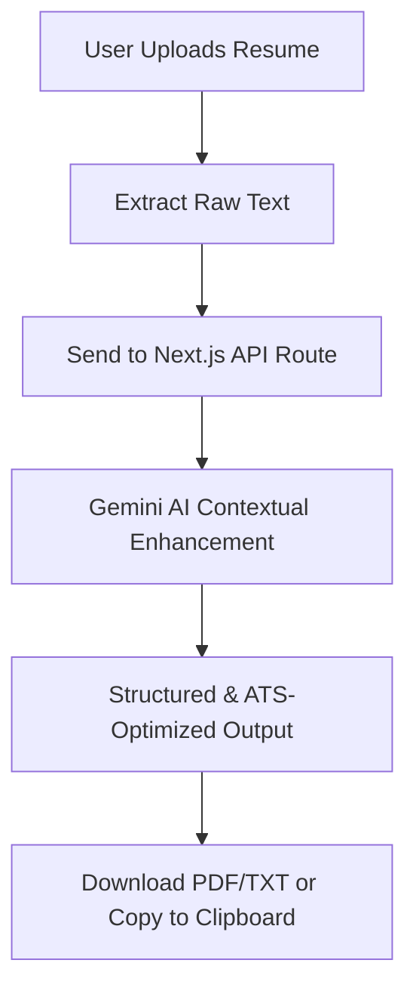

# 🚀 AI Resume Studio
An AI-powered resume enhancement, optimization, and analysis tool that transforms raw resumes into ATS-friendly, recruiter-ready documents using Generative AI.

Built with Next.js (App Router), TypeScript, Tailwind CSS, and the Google Gemini API, this project showcases full-stack AI integration, robust file processing, and modern UI/UX design.

## 🌐 Live Demo
👉 Deploy Live on Vercel (Replace with your actual link)

## ✨ Key Features
* 📂 Multi-Format Upload Support: Seamlessly upload resumes in PDF, DOC, DOCX, and TXT formats.

* 🤖 Gemini AI Optimization: Leverages advanced LLMs to polish grammar, elevate professional tone, and align content with industry standards.

* 📊 ATS Keyword Scoring: Restructures content to rank higher in Applicant Tracking Systems (ATS).

* 🧠 Smart Restructuring: Automatically categorizes messy raw data into sleek sections (Summary, Skills, Experience, Education).

* 📋 One-Click Actions: Quickly copy the enhanced markdown text to your clipboard.

* 📥 Flexible Export Options: Download your newly optimized resume as a clean text file (TXT) or a formatted PDF.

* ⚡ Edge-Ready API Routes: Powered by Next.js Server Routes for blazing-fast, secure API handling.

* 📱 Fully Responsive UI: A gorgeous, accessible dark/light mode interface optimized for mobile, tablet, and desktop viewports.

## 🧠 How It Works


- Extraction: The user uploads their existing resume file, and the application extracts the raw text.
- Contextual Processing: The text is passed securely through Next.js API routes to the Google Gemini API with system prompts tailored for recruitment standards.
- Restructuring: The AI analyzes, corrects, and formats the text into an ATS-friendly layout.
- Export: The frontend dynamically renders the results, ready for instant export via jsPDF.

## 🛠️ Tech Stack
1. Frontend & UI
- Framework: Next.js 14+ (App Router)
- Library: React.js
- Language: TypeScript
- Styling: Tailwind CSS
- Icons: Lucide React

2. Backend & AI
- Server Architecture: Next.js Route Handlers (API Routes)
- AI Engine: Google Gemini API

## Client Utilities
- PDF Generation: jsPDF

## 🏗️ Project Architecture
```text
ai-resume-studio/
├── app/
│   ├── layout.tsx            # Global Layout & Providers
│   ├── page.tsx              # Landing Page / Dashboard
│   ├── resume-enhancer/      # Enhancer Tool Page
│   ├── resume-analyzer/      # Analytics & Scoring Page
│   └── api/
│       └── enhance/          # Core Gemini API Endpoint
│           └── route.ts
├── components/
│   ├── Sidebar.tsx           # Navigation Sidebar
│   └── ui/                   # Reusable UI Elements
├── public/                   # Static Assets
└── package.json
```

## 🚀 Getting Started
Follow these steps to set up the project locally on your machine.

Prerequisites

- Node.js (v18.x or higher recommended)
- npm, yarn, or pnpm
- A Google Gemini API Key (Get one from Google AI Studio)

1. Clone the Repository
```bash
git clone https://github.com/your-username/ai-resume-studio.git
cd ai-resume-studio
```

2. Install Dependencies
```bash
npm install
```

3. Environment Setup
- Create a .env.local file in the root directory of your project and add your API credentials:
```bash
# Google Gemini API Key
GEMINI_API_KEY=your_key_here
```

4. Run the Development Server
```bash
npm run dev
```

5. View the App
```bash
Open your browser and navigate to http://localhost:3000 to see your app running live.
```

## 📝 License
This project is licensed under the MIT License - see the LICENSE file for details.

## 🤝 Contributing
Contributions, issues, and feature requests are welcome! Feel free to check the issues page.

Made with ❤️ by Siya Gupta
